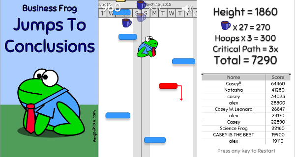

Business Frog Jumps to Conclusions
============

Join Business Frog from [Amphibian.com](http://amphibian.com) as he jumps through
the dystopian world of software project management. 

About
-----
Fork of Octocat Jump (from the GitHub Game Off 2012), modified for the **GitHub Game Off 2015**.

The game is written in JavaScript using the [Crafty](http://craftyjs.com) framework.

It also uses some [jQuery](http://jquery.com/).

How To Play
-----------

Business Frog is trying to manage a large and complicated software project. Use the
left and right arrow keys to guide his jumps through the Gantt chart.

Blue tasks are normal platforms that he can bounce on. The black platforms are major tasks - jumping on one is
a major boost forward! Hit the red critical path tasks in sequence to get a multiplier bonus
at the end of the game...but if you miss one the count starts all over!

As you get higher, apples (representing new requirements) will fly in from the sides and 
try to knock you off schedule.

Cake in the lunch room?
All your engineers just left their desks and the time-to-complete gets longer (temporarily).
Is that a good thing in this case?

Jump through management hoops for more bonus points.

Credits
-------
The original game was made by [Omar Goshen](https://github.com/ogoshen).

[Pow Studio](http://powstudios.com/content/smoke-animation-pack-1) - for the smoke jump sprite.  

Loading Spinner: (https://github.com/tobiasahlin/SpinKit)

Coffe Cup Image: (https://openclipart.org/detail/193527/coffee-cup)

Coffee Sound: (http://www.freesound.org/people/Cabeeno%20Rossley/sounds/126412/)

Apple Bonk Sound: (http://www.freesound.org/people/timgormly/sounds/170141/)

Cake Sound: (http://www.freesound.org/people/plasterbrain/sounds/243020/)

Spin Sound: (http://freesound.org/people/jhka/sounds/139001/)

Hoop Sound: (http://freesound.org/people/suntemple/sounds/253177/)